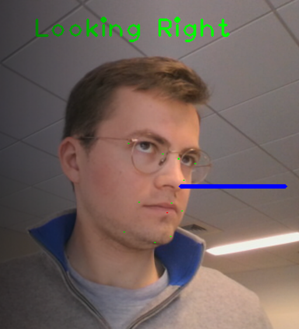

# FaceMesh2Cortex
 
This repository enables to use the FaceMesh model to extract face landmarks around the mouth. It can also be sued to compare those extracted landmarks to those extracted by the cortex system.



## Extract landmarks from a video
run `video_processing.py`
choose the video you want to process
The video will play at processing speed, not at normal speed. you may visually confirm the position of the landmarks. Absent landmarks are replaced with NaNs
if you change the code to put webcam=True, you can have it run on your webcam for fun, nothing is registered.

## compare cortex and FaceMesh
run `GUI.py`
then select the csv file with the cortex landmarks (header and data)
the select the csv file with the FaceMesh dta extracted in the previous step

Choose the landmark to use for analysis. LLx is a good choice.
Left-click on the plot to place markers for trimming. In case of a mistake, right-click to delete previous marker. Please only put two markers. When done, close the plot window. 
Another plot window with the trimmed signal will appear, just for a visual check. Close that window and then select the save file for the cortex trimmed signal and then for the facemesh trimmed signal.

It is not yet possible to align manually the signals, it is done automatically. If auto-alignment fails, please report the case where that happens.
The way the automatic alignment is made consists of taking each landmark/dimension (LLx, Uly, etc) and shifting the signals to get the maximum Pearson correlation. Since different signals have different offsets but should all share the same offsets (video start vs cortex start), the code selects the offset that comes out the most times amongst landmarks/dimensions and keeps it as the ground truth offset.
vertical resizing is done by simply fitting the mean and the standard deviation of cortex (to fit the movements in pixels of FaceMesh to the movement in cm of Cortex).

# Getting Started

## Step 1: Download and Install PyCharm Community Edition
1. Go to the PyCharm website: [https://www.jetbrains.com/pycharm/download](https://www.jetbrains.com/pycharm/download).
2. Scroll down to the "Community" section.
3. Select the appropriate installer for your operating system (Windows/macOS/Linux) and download it.
4. Once the download is complete, run the installer.
5. Follow the installation wizard's instructions:
   - Choose a destination folder (the default location is recommended).
   - Select any additional components you want to install (optional).
   - Click "Next" to proceed.
   - Accept the license agreement and click "Next".
   - Choose the installation options (default options are recommended).
   - Click "Install" to begin the installation.
6. After the installation completes, close the installer.

## Step 2: Open an Existing Project from GitHub
1. Open PyCharm Community Edition.
2. On the welcome screen, click on "Get from Version Control" or select "File" -> "New" -> "Project from Version Control".
3. In the "Version control" dropdown, select "Git".
4. Copy the URL of the GitHub project you want to open.
5. In the "URL" field, paste the copied URL.
6. Choose a directory where you want to store the project on your local machine.
7. Click "Clone" to clone the repository and open the project.

## Step 3: Create a Python Interpreter for Python 3.7.0 and Set Up a Virtual Environment
1. Once the project is open in PyCharm, go to the top menu and select "File" -> "Settings".
2. In the Settings window, navigate to "Project: Your_Project_Name" -> "Python Interpreter" (or similar).
3. Click on the gear icon on the right and select "Add".
4. In the "Add Python Interpreter" window, select "System Interpreter" and click on the drop-down list.
5. If Python 3.7.0 is listed, select it as the interpreter.
   - If Python 3.7.0 is not listed, click on "Show All..." and select the path to your Python 3.7.0 interpreter.
   - If you don't have Python 3.7.0 installed, refer to the official Python documentation to install it.
6. Click "OK" to create the Python interpreter.

7. To set up a virtual environment (venv), go back to the "Add Python Interpreter" window.
8. This time, select "Virtualenv Environment" and click "OK".
9. Choose a location for the virtual environment directory or use the default location.
10. Ensure that the newly created virtual environment is selected as the interpreter.
11. Click "OK" to apply the changes.

## Step 4: Install Project Requirements from `requirements.txt`
1. In PyCharm, ensure that the FaceMesh project is open.
2. Open the terminal within PyCharm (bottom toolbar or "View" -> "Tool Windows" -> "Terminal").
3. Make sure the terminal is using the correct virtual environment by checking the prompt (it should show the virtual environment name).
4. Run the following command in the terminal to install the project's requirements:
   ```
   pip install -r requirements.txt
   ```
   This command will install all the packages listed in the `requirements.txt` file.
5. Wait for the installation to complete.
